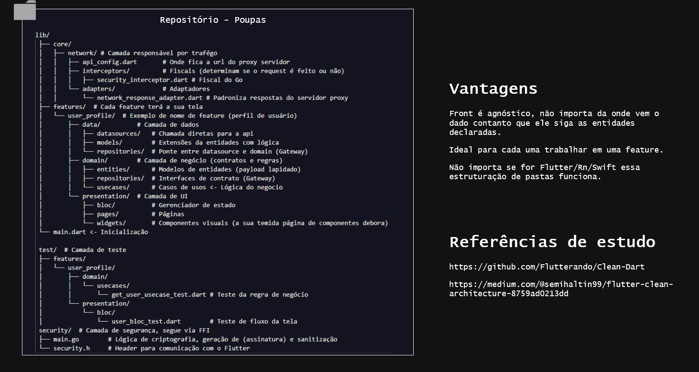

## Arquitetura do Projeto - Poupas

Esta documentação descreve a estrutura de pastas e as responsabilidades de cada camada, seguindo os princípios de Clean Architecture (Arquitetura Limpa). Esta estrutura é agnóstica a frameworks e foca na testabilidade(TTD) e escalabilidade.

## 📂 Visão Geral do Sistema de Pastas
1. lib/core/ (Núcleo e Infraestrutura)

Contém recursos globais compartilhados por toda a aplicação. 

    network/: Gerencia todo o tráfego de dados externo.
        api_config.dart: Configurações de URL e conexão com o proxy/servidor da api.

        interceptors/: Regras de execução.

        adapters/: Padronização de objetos de resposta vindos do servidor.

2. lib/features/ (Funcionalidades de Negócio)

Cada funcionalidade do app (ex: user_profile) é isolada em sua própria pasta, contendo três subcamadas fundamentais:

- data/ (Camada de Dados)

Implementação técnica de onde os dados vêm.

    datasources/: Contém as chamadas diretas para a API.

    models/: Extensões das entidades que lidam com serialização/desserialização (ex: fromJson, toJson).

    repositories/: Implementação concreta das interfaces definidas no Domain (ponte Gateway).

- domain/ (Camada de Negócio)

Contém a lógica pura do negócio. Não deve depender de bibliotecas externas ou do Flutter.

    entities/: Modelos de dados puros (payload lapidado).

    repositories/: Interfaces (contratos) que o dado deve seguir.

    usecases/: Casos de uso específicos que contêm a regra de negócio central.

- presentation/ (Camada de UI)

Responsável por tudo o que o usuário interage visualmente.

    bloc/: Gerenciadores de estado (lógica da tela).

    pages/: As visualizações completas (telas).

    widgets/: Componentes visuais menores e reutilizáveis.

3. security/ (Camada Nativa via FFI)

Camada de segurança crítica escrita em Golang.

    main.go: Lógica de criptografia, geração de assinaturas e sanitização.

    security.h: Header necessário para comunicação com o Flutter.

4. test/ (Camada de Testes)

Espelhamento da lib para garantir a cobertura de testes automatizados.

    domain/usecases/: Testes unitários das regras de negócio.

    presentation/bloc/: Testes de fluxo e transição de estados da interface.

## 🔗 Referências de Estudo

    https://github.com/Flutterando/Clean-Dart

    https://github.com/Flutterando/Clean-Dart